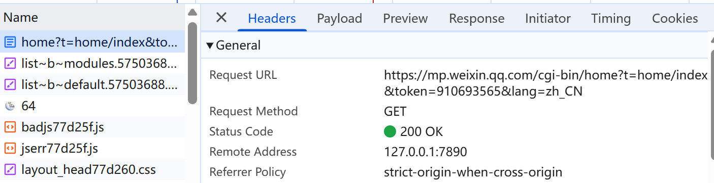

# wechat_crawler

微信公众号历史文章爬虫+每日定时爬虫

1. 打开微信公众号平台，随意选择一个自己的公众号登陆，`Ctrl+Shift+I` 打开控制台，选择网络（network），点击“首页” `home` 开头的网址，在里面可以找到你的token (在General -> Request URL中) 和Cookie (在Request Headers中)

   

2. 将 `wechat_crawler_config.json` 中的 token和Cookie替换掉，用于`daily_wechat_crawler.py`，其中 `last_update` 用于设置从上次爬取过的文件之后开始爬取，每次爬取后会自动保存，`accounts`是要爬取的公众号

```json
{
  "token": "910693565",
  "last_update": {
    "学生清华": {
      "last_aid": "2649761947_1",
      "last_time": 1754458048
    }
  },
  "max_articles_per_account": 100,
  "accounts": [
    "学生清华"
  ],
  "cookie": "ua_id=oSu8DmY0O8VPHxMXAAAAAJniiXuVOE-4vwgaMGuVhtc=;......
}
```

3. ```bash
   python daily_wechat_crawler.py # 自动创建当天的推送文件夹，并保存为json格式
   ```

4. 通过 `daily_wechat_crawler.dat` 为windows创建定时任务，从而实现每天的定时爬取

5. `get_cookie.py` 可用于提取一个公众号的所有历史信息（是daily_wechat_crawler.py的初级版）